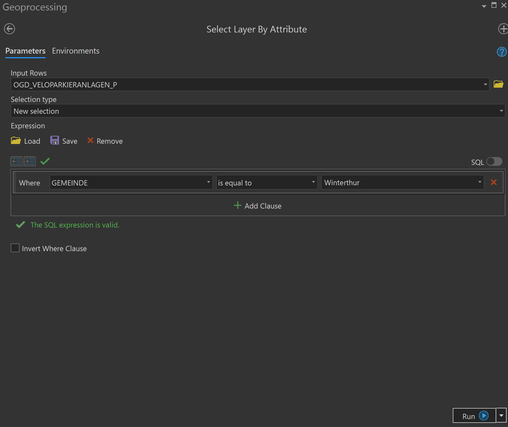
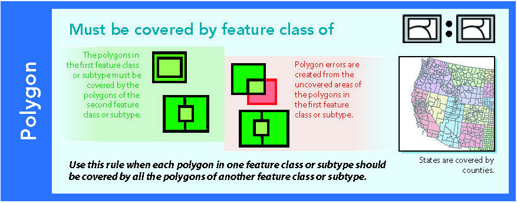
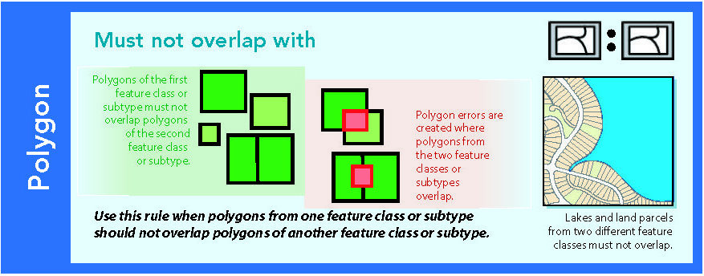
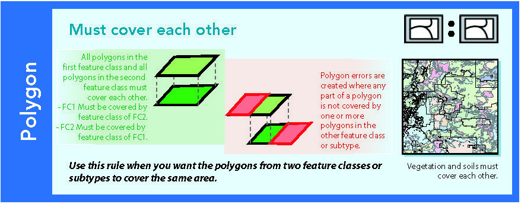

```{r,echo=FALSE,message=FALSE,warning=FALSE}
library(tidyverse)
library(tiff)
```


# Abstract

This is a resource for people coming from ArcGIS who want to do spatial stuff (Analysis, Visualization) in R. This resource should provide some help on this journey.

Who this book is for:

- you've worked primarily with ArcGIS and would like to transition to R
- you have some experience with R
- you don't mind working with the tidyverse


# Foreword

I had long since thought about the necessity of a resource which helps ArcGIS users transition to R or Python. I had [tweeted this](https://twitter.com/NRatnaweera/status/1187759876472213504) without getting much reception, and and one point just decided to start my own resource. 


I, like many, learned GIS in University using ArcGIS. It took me a considerable amount of time to learn that there are alternatives to ArcGIS, but not much longer to realize that I'm more attracted to these alternatives than to ArcGIS. When you transition from a proprietary Software like ArcGIS to FOSS, you have to relearn many of the concepts because the proprietary software usually does not adhere to common standards. 

There are already a great many spatial-R Resources out there, and I'm not planning to rewrite everything that has been written. My aim is just to provide a resource for people looking to do spatial stuff in R, but only know the ArcGIS-Term for it. This might mean that for some topics, I will simply provide a link to an existing resource. 

  


<!--chapter:end:index.Rmd-->

# Making Maps

Probably the quickest way to visualize spatial data is with `base::plot()`.
It can handle raster as well as vector data and usually needs not more than this one command, plot().
This can be great to get a first, quick look at the data but in my opinion, base plot will not get you very far. To make nice static maps, you are better served with `ggplot2` or with `tmap`.
There are arguments for both packages, and you might just end up using both.

<!--chapter:end:01_Making_Maps/Making_Maps.Rmd-->

## Making Static Maps

Before you start making maps however, you will have to familiarize yourself with importing raster or vector data into R in the first place. For Vector data, you can read chapter [2.2 Vector data](https://geocompr.robinlovelace.net/spatial-class.html#vector-data) from the book "Geocomputation with R". The next chapter [2.3 Raster data](https://geocompr.robinlovelace.net/spatial-class.html#raster-data) provides a very good overview on rasterdata in R


### Static maps with `ggplot2`

#### Basics
```{r}
library(sf)
library(tidyverse)


getwd()
eire <- read_sf("sample_data/spData/eire.shp")
```

The most basic plot consists of a `ggplot()` initiation and a single layer. In case of `sf` data, you can add a layer with `geom_sf()`. If the coordinate system is unknown, the axes will be labelled with the numerical values of the coorindates.
```{r}
st_crs(eire)
ggplot(eire) + 
  geom_sf()
```

However, if the coordinate system *is* known, the WGS84 Coordinates are labelled and used as the major and minor grid lines.

```{r}
eire <- st_set_crs(eire, "+proj=utm +zone=30 +ellps=airy +units=km")

ggplot(eire) + 
  geom_sf()
```

As always in `ggplot`, if you want to use a column from your dataset as an input for, say, colour, you need to specify this with `aes()`:
```{r}
ggplot(eire) + 
  geom_sf(aes(fill = INCOME))
```

There are various ways to beautify this simple plot:

```{r}
ggplot(eire) + 
  geom_sf(aes(fill = log(INCOME)), colour = "grey") +
  labs(title = "Counties of the Irish Republic", 
       subtitle = expression("Distribution of Income (log"[10]*")"),
       fill = "") +
  scale_fill_viridis_c() +
  theme_void() +
  theme(legend.position = "bottom")
```

#### Adding Raster Maps Files (geotiffs)

While vector data is very easily implemented in ggplot2, rasterdata is a little harder. Its complicated enough with standard Raster Data, and even more so with raster maps.  There are two packages that facilitate the combination of rastermaps and ggplot: 

- [`rasterVis`](https://oscarperpinan.github.io/rastervis/)
- [`RStoolbox`](https://bleutner.github.io/RStoolbox/)

However, we will do without these packages to learn more on how rasters work and be as flexible as possible.

If you don't have the time or patience to read through the explanation, the following function takes a path to a raster and returns a dataframe with x/y coordinates as well as a column with the hex colours for the according cell.

```{r}
rastermap_to_dataframe <- function(path) {
  require(tiff)
  require(raster)
  raster_file <- raster::brick(path)
  bands_n <- nbands(raster_file)
  if(bands_n == 1){
    raster_indexed <- readTIFF(path,indexed = TRUE)
    raster_colormap <- attr(raster_indexed,"color.map")
    raster_colormap_hex <- rgb(raster_colormap[1,],raster_colormap[2,],raster_colormap[3,])
    raster_df <- data.frame(coordinates(raster_file), values = raster_colormap_hex[getValues(raster_file)+1])
  } else if(bands_n == 3){
    raster_df <- data.frame(
      coordinates(raster_file),
      values = rgb(values(raster_file[[1]]),values(raster_file[[2]]),values(raster_file[[3]]),maxColorValue = 255)
    )
  }
  return(raster_df)
}
```

##### With Colours

Tif files with colours can either be single band or include multiple bands in a single tif file. These need to be treated differently. Let's take two variants of the [swiss raster map 1:50k](https://shop.swisstopo.admin.ch/de/products/maps/digital_maps/digital/srm10) map. One is a single band dataset, the other a 3-band dataset.

```{r}
library(raster)

path_1b <- "sample_data/SMR_Musterdaten/SMR50_LV95_KOMB_Mosaic.tif"
path_3b <- "sample_data/SMR_Musterdaten/SMR50_LV95_KREL_10L_Mosaic.tif"

raster(path_1b)
raster(path_3b)
```

As you can see in the output of `raster(path_3b)`, only one of the 3 bands was imported with `raster::raster`. In the case of multiband rasters, it's better to use `raster::brick`:

```{r}
map_1b <- raster(path_1b)
map_3b <- brick(path_3b)
```

###### Singleband

A singleband RasterLayer can be regarded as vector of numeric values arranged in a matrix with some additional metadata. The metadata can be view with `str()`, the values can be obtained with `getValues()`.

```{r}
str(map_1b)
head(getValues(map_1b),50)

extent(map_1b)
```

The first 50 cells of this `RasterLayer` contain the value `37`. This value `37` is associated with a specific colour, which can be viewd in the `colortable` of the `RasterLayer`.

```{r}
coltab <- colortable(map_1b)
head(coltab)
scales::show_col(coltab,labels = FALSE)
```


In order to plot this `RasterLayer` in ggplot, we need to convert it into a dataframe. You can imagine that this is converting the wide matrix into a very long table with three columns: x and y coordinates of the lower left corner of each cell and a value specifying what the cell holds. 

```{r}
map_1b_df <- data.frame(coordinates(map_1b),values = getValues(map_1b))
head(map_1b_df)
```

We can now use the `values` column in `ggplot2` to specify the `fill` aesthetic. If we then pass the colortable as our fill values, the colours will be matched correctly. However we need two additional tricks:

- name the colourtable to make sure the correct colours are correct to the according values
- wrap the `values` column in `factor()` so that the `ggplot2` does not mistake the numeric values as a continuous scale:


```{r}
names(coltab) <- 0:255 # 1:256 would be wrong by 1

ggplot() +
  geom_raster(data = map_1b_df, aes(x,y, fill = factor(values))) +
  scale_fill_manual(values = coltab) +
  theme(legend.position = "none") +
  coord_equal()

```

Note that there are thee ways to plot this type of data in `ggplot2`: `geom_rect`, `geom_tile` and `geom_raster`. The latter is "a high performance special case for when all the tiles are the same size" (see [the docs](https://ggplot2.tidyverse.org/reference/geom_tile.html).


Alternatively, you can add the hex colourcode to the dataframe and use `scale_fill_identitiy()`.
```{r, eval = FALSE}
map_1b_df <- mutate(map_1b_df, colorvalue = coltab[values+1])
ggplot() +
  geom_raster(data = map_1b_df, aes(x,y, fill = colorvalue)) +
  scale_fill_identity() +
  theme(legend.position = "none") +
  coord_equal()
```

The big drawback of using `ggplot2` in this way: you cannot add a second layer with a `fill` aesthetic, since `ggplot2` only allows one per plot.

###### Multiple bands


In case of a 3-Band Raster Brick, each layer holds a value of 0 to 255 representing colours in the RGB colour model. Usually, the first layer represents **R**ed, the second **G**reen and the third **B**lue. We can subset the `RasterBrick` into the individual `RasterLayers` using double brackets (`[[1]]` for the first layer).

```{r}
map_3b

map_3b[[1]]
```

As with the singleband raster, we can extract the Values (this time RGB-Values) of each layer with `getValues()`.

```{r}
head(values(map_3b[[1]]),50)
```

Again like with the single band raster, we now transform the Raster into a dataframe, this time storing the rgb values in columns (instead of the hex values as before).

```{r}
map_3b_df <- data.frame(
  coordinates(map_3b),
  r = values(map_3b[[1]]), 
  g = values(map_3b[[2]]),
  b = values(map_3b[[3]]))

head(map_3b_df)
```


With the function `rbg()` we can transform values into hex-codes.
```{r}
rgb(10,10,10,maxColorValue = 255)

ggplot() + 
  geom_raster(data = map_3b_df, aes(x,y,fill = rgb(r,g,b,maxColorValue = 255))) + 
  scale_fill_identity() +
  coord_equal()
```

Tipp: if your file is to large and ggplot has trouble plotting it fast, you can use `aggregate` to reduce the resolution

```{r}
map_3b_lowres <- raster::aggregate(map_3b, fact = 5)
```


##### Greyscale

In greyscale maps, `raster` cannot find a associated colortable to match the values to rgb or hex colours.
```{r}
map_grey_path <- "sample_data/SMR_Musterdaten/SMR50_LV95_KGRS_Mosaic.tif"
map_grey <- raster(map_grey_path)

head(getValues(map_grey))
head(colortable(map_grey))
```

However, the package `tiff` _can_ find the rgb values of a tiff, we just need to set `indexed = TRUE` and get the `color.map` attribute of the output:

```{r}
library(tiff)

index <- readTIFF(map_grey_path,indexed = TRUE)
colormap <- attr(index,"color.map")


colormap[,1:8] # only showing the first 8 columns (of 256)
```

This is an index with three rows (**R**ed, **G**reen and **B**lue) and 265 columns (with are the Values from `getValues()`). We can now use `rgb()` to turn this matrix into a vector of 265 hex colours:

```{r}
coltab <- rgb(colormap[1,],colormap[2,],colormap[3,])

scales::show_col(coltab,labels = FALSE)
```

Like before, we now turn the `RasterLayer` into a dataframe and use the `Values` and the newly created colortable to assign the correct values:

```{r}
map_grey_df <- data.frame(coordinates(map_grey),values = getValues(map_grey))


names(coltab) <- 0:255

ggplot() +
  geom_raster(data = map_grey_df, aes(x,y, fill = factor(values))) +
  scale_fill_manual(values = coltab) +
  theme(legend.position = "none") +
  coord_equal()
```


<!--chapter:end:01_Making_Maps/Static_Maps.Rmd-->

## Making Interactive Maps

Probably one of the first things you want to do when working with a dataset is visualizing it spatially. This is basically always the first thing you do in ArcGIS. So how do you this in R?

If your aim is to explore the data, to just get a feel for it, your map needs to:

1. allow pan and zoom
2. display attribute information in popups
3. provide a background map
4. be easy to make

Before you start making maps however, you will have to familiarize yourself with importing raster or vector data into R in the first place. For Vector data, you can read chapter [2.2 Vector data](https://geocompr.robinlovelace.net/spatial-class.html#vector-data) from the book "Geocomputation with R". The next chapter [2.3 Raster data](https://geocompr.robinlovelace.net/spatial-class.html#raster-data) provides a very good overview on rasterdata in R

There are many packages that provide these features. 

- [`leaflet`](https://rstudio.github.io/leaflet/)
- [`mapview`](https://r-spatial.github.io/mapview/)
- [`tmap`](https://github.com/mtennekes/tmap)

In terms of simplicity, versatility and scalability `tmap` is one of the best in my option. 

### Introduction to `tmap`

To see how it works, import the usual libraries and the North Carolina Sample data.


```{r}
library(sf)
library(tidyverse)
library(tmap)

nc <- st_read(system.file("shape/nc.shp", package = "sf"),quiet = TRUE)
```

Here's how the data looks in base plot:

```{r, echo = FALSE}
plot(st_geometry(nc))
```

`tmap` has two modes: a static mode for printable maps (called `plot`) and a dynamic mode for exploratory, interactive maps (called `view`). We want the latter for now, so we switch to the dynamic mode with: 
```{r}
tmap_mode("view")
```

`tmap` has based it's syntax loosely on `ggplot2`: Mainly, layer are added with `+` and aesthetics are specified within each layer.
```{r}
tm_shape(nc) +
  tm_polygons()
```

You can have a look at the attributes of each feature by clicking on it. To view the entire attribute table, you can print `nc` to the console, or have a look at it with `View(nc)` if you are using Rstudio.

Check the following resources for more information:

- https://github.com/mtennekes/tmap
- https://geocompr.robinlovelace.net/adv-map.html#interactive-maps


<!--chapter:end:01_Making_Maps/Dynamic_Maps.Rmd-->

# Basic spatial operations


## Clip operation
```{r,echo=FALSE}
knitr::opts_chunk$set(warning = F, message = F, tidy = T)
```

Quite often in spatial analysis, we come across with cases, where we do not want to use all the available data there is. In other words, we want to focus on a specific area of interest, which dictates the need for __clipping__ the existing dataset based on it's relationship to some other existing spatial feature. In R this operation can be easily performed using the _st_intersection_ function in __sf__.
  
Let's assume in the example below that we want to clip the available dataset of all the __train stations in Switzerland__ by focusing our analysis on four specific cantons.


```{r}

# Point dataset depicting the train stations locations across Switzerland
bahn_haltestelle_ch <- st_read("sample_data/other/Haltestelle_Bahn_CH.shp")

# Dataset depictinG Switzerland on canton level
kantonsgebiet <- st_read("sample_data/other/Kantonsgebiet.shp")

tmap_mode(mode = c("plot")) # setting the plotting mode to static -- optimizing the process

tm_shape(kantonsgebiet) + tm_polygons("#f0f0f0") + 
  tm_shape(bahn_haltestelle_ch) + tm_dots(col = "#e34a33",size = 0.1, alpha = 0.5) + 
  tm_shape(kantonsgebiet) + tm_borders(col = "black") + tm_layout(frame = F)
   
```


As it was mentioned above, the aim is to analyse the situation at a particular area. So we are going to create an index with the specific cantons we are interested in.


```{r}
index <- kantonsgebiet$name == "Zürich" |
  kantonsgebiet$name == "St. Gallen" |
  kantonsgebiet$name == "Thurgau" |
  kantonsgebiet$name == "Aargau"

# Selecting the cantons based on the previously generated index
kantons_aOi <- kantonsgebiet[index,]

# Performing the clipping operation
hal_clipped <- st_intersection(kantons_aOi,bahn_haltestelle_ch)
```

 - Plotting the result from the clipping operation
```{r}
tm_shape(kantons_aOi) + tm_polygons("#f0f0f0") + 
  tm_shape(hal_clipped) + tm_dots(col = "#e34a33",size = 0.1, alpha = 0.5) + 
  tm_shape(kantons_aOi) + tm_borders() + tm_layout(frame = F)
```

So, ultimately, as we can see above, the _st_intersection_ function creates a result where the point dataset is precisely "clipped" based on the area of interest


The operation above produces the same outcome as the one depicted in the figure below \@ref(fig:clip).

```{r fig.cap= "Clip operation in ArcGIS pro",echo=F, out.width = "750px",fig.align='center'}
knitr::include_graphics("images/clipOperation.png")
```


## Merge operation

Let's assume that in the example above, instead of having four individual areas of interest, we are interested in having one common, unified area on which we focus our analysis. In other words, we have to __merge__ the existing four areas into one. In ArcGIS pro the respective tools for this action is either the `Merge` or the `Dissolve` tool.  
In R on the other hand, this can be easily performed using the _st_union_ function in the __sf__ package. 

```{r}
# The area of interest from the previous example
kantons_aOi

# Merging the four areas into one
aOi_merged <- st_union(kantons_aOi)
```

- Plot the merged area of interest

```{r}
tm_shape(aOi_merged) + tm_polygons("#f0f0f0") + tm_layout(frame = F)
```

The operation above produces the same outcome as the one depicted in the figure below \@ref(fig:dissolve).

```{r, fig.cap= "Dissolve operation in ArcGIS pro",echo=F, out.width = "750px",fig.align='center'}
knitr::include_graphics("images/dissolve.png")
```


## Buffer operation

One of the most commonly used operations in ArcGIS pro is the one called `Buffer`. This operation provides a very convenient way of identifying areas of interest lying in the neighborhood of an existing spatial feature. In R the same action can be performed using the _st_buffer_ function in __sf__. 

Below we introduce a line spatial feature that depicts all the __mountain bike routes__ in Switzerland.
```{r, echo=F}
mountainBikes_routes <- st_read("sample_data/other/mountainBikes_routes.shp")
```

```{r, echo=F}
tm_shape(kantonsgebiet) + tm_polygons("#f0f0f0") + 
  tm_shape(mountainBikes_routes) + tm_lines(col = "#e34a33") + 
  tm_shape(kantonsgebiet) + tm_borders(col = "black") + tm_layout(frame = F)
```

We focus, as an area of interest, on the canton of Valais. Consequently, we might be interested in identifying all the areas in a radius of 1000 m around these bike routes.

- Selecting the canton of Valais

```{r, echo=FALSE}
index2 <- kantonsgebiet$name == "Valais"
canton_valais <- kantonsgebiet[index2,]
mountainBikes_routes_valais <- st_intersection(mountainBikes_routes,canton_valais)

tm_shape(canton_valais) + tm_polygons("#f0f0f0") + 
  tm_shape(mountainBikes_routes_valais) + tm_lines(col = "#e34a33") + 
  tm_shape(canton_valais) + tm_borders(col = "black") + tm_layout(frame = F)
```

- Apply a buffer of 1000m on each of the mountain bike routes within the canton of Valais

```{r}
routes_buffer <- st_buffer(mountainBikes_routes_valais,1000)

tm_shape(canton_valais) + tm_polygons() + 
  tm_shape(mountainBikes_routes_valais) + tm_lines(col = "#e34a33") +
  tm_shape(routes_buffer) + tm_polygons(col = "blue", alpha = 0.2) + 
  tm_shape(canton_valais) + tm_borders(col = "black") + tm_layout(frame = F)
```


The operation above produces the same outcome as the one depicted in the figure below \@ref(fig:buffer).

```{r buffer, fig.cap= "Buffer operation in ArcGIS pro",echo=F, out.width = "750px",fig.align='center'}
knitr::include_graphics("images/buffer.png")
```
=======

<!--chapter:end:02_Select/Basic_spatial_operations.Rmd-->

## Select by Attribute
```{r,echo=FALSE}
knitr::opts_chunk$set(warning = F, message = F, tidy = T)
```


One of the popular approaches in ArcGIS pro for selecting features in a layer is by using an attribute query. The action is performed using the `Select By Attributes` tool.

`Select By Attributes` tool allows us to provide an SQL query expression to select features that match the selection criteria.

__R__ on the other hand offers quite easy and straightforward options to perform similar operations. Let's examine one of them.

As a first step, we might want to import a shapefile. To do so, we can use __sf package__ to work with vector data in R. Important to know is that the **rgdal package** automatically loads when sf is loaded.

In the code snippet below, we read the shapefile, which represents the __parking spots for bicycles__ within the canton of Zurich. The dataset is publicly available for download in the following link: (https://opendata.swiss/en/dataset/veloparkierungsanlagen).

```{r}
library(sf)
library(ggplot2)
parkBikes <- st_read("sample_data/Kanton_Zuerich/Veloparkierungsanlagen/OGD_VELOPARKIERANLAGEN_P.shp")
```

After importing the dataset, let's say we want to filter it by selecting only the parking spots that lie within a specific municipality (Gemeinde) in the canton of Zurich. More specifically, we will select only the parking spots within the municipality of Winterthur.
For the aforementioned operation, R offers the function `filter()`, which lies within the __dplyr__ package.
This functions works as follows: `filter(dataset, condition)`

```{r}
library(dplyr)
parkBikes_winti <- filter(parkBikes,GEMEINDE == "Winterthur")
```

```{r,echo = F, fig.align='center'}
ggplot() + geom_sf(data = parkBikes) + geom_sf(data = parkBikes_winti, fill = "red", aes(color = "Bike parking spots in Winterthur")) + ggtitle("Bike parking facilities in Canton Zurich") + theme_minimal() + labs(color = " ") + theme(legend.position = "bottom")
```


The operation above produces the same outcome as the one depicted in the figure below \@ref(fig:select).

```{r select, fig.cap= "Select by Attributes in ArcGIS pro",echo=F, out.width = "500px",fig.align='center'}

```


<!--chapter:end:02_Select/Select_by_Attribute.Rmd-->

## Select by Location

```{r,echo=FALSE}
knitr::opts_chunk$set(warning = F, message = F, tidy = T)
library(dplyr)
library(sf)
library(ggplot2)
```
One of the most commonly used operations in ArcGIS pro is the process of selecting features of a spatial object (layer) based on whether or not these relate spatially to another object (layer). This process is also referred as __spatial subsetting__. In ArcGIS pro this can be performed in various ways using the `Select by Location tool`. 

In __R__ the same operation is, on a first level, performed using the `square bracket ([])` operator from the base R package.

An example of spatial subsetting could be the following. Let's assume we have as a shapefile (polygon dataframe) with all the municipalities (Gemeinde) of the Canton of Zurich. Furthermore, we are also using a shapefile in the form of a point dataframe, which represents all the __"swimming spots"__ (Badenplätze) in the same spatial region (Canton of Zurich). So, ultimately, our goal is to find out the __"swimming spots"__ that lie within a specific municipality of the Canton of Zurich. 


```{r echo=T}

# Minicipalities (Gemeinde) in Canton Zurich
gemeinde_ZH <- st_read("sample_data/Kanton_Zuerich/Gemeinde_ZH.shp")

# "Swimming" spots in the Canton of Zurich
swimmSpots <- st_read("sample_data/Kanton_Zuerich/Badeplaetze_ZH.shp")
```

```{r, echo=F}
# Municipality (Gemeinde) of Richterswil 
richterswil <- dplyr::filter(gemeinde_ZH, gemeindena == "Richterswil")
names(richterswil)[5] = "Municipality"

ggplot() + geom_sf(data = gemeinde_ZH) + geom_sf(data = richterswil,aes(fill = Municipality)) + geom_sf(data = swimmSpots,color = "blue") + ggtitle("Swimming spots in the Canton of Zurich") + theme_minimal()
```

After importing and depicting the __"swimming spots"__ throughout the canton of Zurich, let's assume we want to check if and how many of them __lie within__ the Municipality of Richterswil. To do so, we will perform an operation, which belongs to the category of __Spatial subsetting__.

```{r}
swimmSpots_richt <- swimmSpots[richterswil, ,op = st_within]
```

```{r,echo=F}
ggplot() + geom_sf(data = gemeinde_ZH) + geom_sf(data = swimmSpots,color = "blue") + geom_sf(data = richterswil, fill = "white") + geom_sf(data = swimmSpots_richt, color = "red") + ggtitle("Swimming spots in the Canton of Zurich") + theme_minimal() 
```

The operation above is based on the following rule: `x[y, ,operation]`, where:  

<style>

div.note { background-color:#f0f0f0; border-radius: 5px; padding: 20px;}
</style>
<div class = "note">

-  __x__ and __y__ are the spatial objects for which we want to investigate if there is a spatial relationship (x is the target feature, while y is the source one)  
-  the second argument __[, ,]__ within the brackets denotes the column number we want to retrieve from the spatial subsetting. In our example this argument was empty, which means we wanted to retrieve all rows for every __attribute column__.  
-  the third argument __[op = ]__ specifies the spatial operation we want to perform. In the example above, the goal was to find out how many subset features of the target object _swimmSpots_ lie withing the source spatial object _richterswil_. For that reason we chose the function __st_within()__.

</div>

Depending on what we want to examine, we choose the respective function.


<!--chapter:end:02_Select/Select_by_Location.Rmd-->


# Data Management Toolbox

Data Management toolbox in ArcGIS pro provides the users a variety of tools for managing,
maintaining and developing datasets that come in all possible forms (feature classes / datasets, raster datasets). Below we present all the different options that R offers for performing such operations.

## Joins Toolset

In R we have two main options for merging two data frames. On the one hand there is 
the base R function called _merge_. The arguments of the _merge()_ function offers the
option to perform natural joins. In other words joins such as inner join, left join, right join etc.
On the other hand we can come up with similar results by using the _join_ functions that
lie within the __dplyr__ package.  
In the examples below, we choose to use the latter case.  

Before we begin with our examples, we have to make clear the differences among the various
forms of join operations.  

  - _Natural join or Inner Join_ reflects on keeping only rows that match from the two data frames.
  - _Full outer join or Outer Join_ reflects on keeping all rows from both data frames.  
  
```{r joins, fig.cap= "Join operations",echo=F, out.width = "500px",fig.align='center'}
knitr::include_graphics("images/joins.png")
```
      
### Inner join

`Inner Join` in R is the most common type of join. It is an operation that returns the rows
when the matching condition is fulfilled. Below we demonstrate it with an example.

```{r}
library(dplyr)
df1 <- data.frame(TeamID = c(1,4,6,11),
                  TeamName = c("new york knicks","los angeles lakers","milwaukee bucks","boston celtics"),
                  Championships = c(2,17,1,17))

df2 <- data.frame(TeamID = c(1,2,11,8),
                  TeamName = c("new york knicks","philadelphia 76ers","boston celtics","los angeles clippers"),
                  Championships = c(2,3,17,0))

df_innerJoin <- df1 %>% inner_join(df2, by = NULL)
df_innerJoin
```

### Outer join

`Outer join` in R using simply returns all rows from both data frames. This is very well depicted in
\@ref(fig:joins).

```{r}
df_fullJoin <- full_join(df1,df2)
df_fullJoin
```

### Left / Right join

The `left join` in R returns all records from the data frame on the left, as well as
and the matched records from the one at the right.  

```{r}
df_leftJoin <- left_join(df1,df2)
df_leftJoin
```  
Similarly works also the `right join`.

```{r}
df_rightJoin <- right_join(df1,df2)
df_rightJoin
```


## Projections and Transformations Toolset

Quite often in GIS, users found themselves before the necessity of transforming
(reprojecting) the coordinate system of a dataset (vector or raster). In fact this
is one of the most commonly used operations. In ArcGIS pro the aforementioned
action is performed using the following tools:

- `Project (Data Management)` -> Projects __spatial data__ from one coordinate system to another.
- `Project Raster (Data Management)` -> Transforms a __raster dataset__ from one coordinate system to another.

The question now is how we can perform similar operations with R. 

### Reproject vector data in R

For our example we will use the following dataset.

- **bezirke.gpkg** -> Dataset that depicts the Municipal structure in Switzerland

**R** and more specifically **sf package** offers options (functions) not only for 
transforming the coordinate system of a dataset, but also for identifying the
current existing one. Let's dive in :)

```{r echo=TRUE, message=TRUE, warning=TRUE}
# Importing the dataset
library(sf)
bezirke <- read_sf("sample_data/other/bezirke.gpkg") 
```

```{r echo=TRUE, message=TRUE, warning=TRUE}
# Visualising the imported dataset
library(ggplot2)
ggplot() + geom_sf(data = bezirke)
```

In order to identify the current coordinate system of a dataset, **sf package**
offers the function _st_crs_. The main usage of the function is to retrieve the
coordinate reference system from an sf object.

```{r echo=TRUE, message=TRUE, warning=TRUE}
# retrieving the coordinate of the imported layer
st_crs(bezirke)
```
As an output we received that there is no assigned coordinate system to this
specific dataset. _st_set_crs_ function helps us assigning a coordinate system
to a dataset.

```{r echo=TRUE, message=TRUE, warning=TRUE}
# Assigning the World Geodetic System (WGS84) as a coordinate system to our dataset
bezirke <- st_set_crs(bezirke, 4326)
```
In the function above, the number 4326 represents the __EPSG Geodetic Parameter Dataset (EPSG)__
of the respective coordinate system. **EPSG** is a public registry of geodetic
datums, spatial reference systems, Earth ellipsoids, coordinate transformations
and related units of measurement.  

```{r echo=TRUE, message=TRUE, warning=TRUE}
st_crs(bezirke)
```
After rerunning the _st_crs_ function, we are getting now that the assigned
coordinate system of the dataset is World Geodetic System (WGS84).  
As a next step, we might want to transform the dataset to the Swiss coordinate system.
The respective **EPSG** for code for the latest Swiss coordinate system
(CH1903+LV95) is 2056. For this purpose we use the _st_transform_ function of the **sf package**.

<span style="color:red">**Important**</span>

<details>
  <summary>**> Click to expand!**</summary>
  _st_set_crs_ function **does not** reproject the coordinates of the given dataset. In
  other words, it does not affect the actual _geometry_ column of the sf object.
  _st_tranform_ on the other hand indeed **does indeed reproject** the dataset to another coordinate
  system.
  </details>  
  

```{r echo=TRUE, message=TRUE, warning=TRUE}
bezirke_swiss <- st_transform(bezirke, 2056)

# retrieve the coordinate system
st_crs(bezirke_swiss)
```


### Reproject raster data in R

Working with Raster datasets in GIS of operations is of equal importance, as
working with vector ones. One of the spatial properties of raster datasets is the 
the Coordinate Reference System (CRS). CRS is the specific system that “associates”
the raster coordinates (which are just pairs of x/y values) to geographic locations.
In ArcGIS pro the tool for projecting a raster dataset is called
_Project Raster (Data Management)_. Let's see how we can perform the same operation
with R. 

```{r}
# Importing the datasets
library(raster)

# Dataset derived from the spatial interpolation of all the available "recycling points"
# in the city of Wädenwil
raster_recycling <- raster("sample_data/Raster/raster_recycling.tif") # CRS -> CH1903+LV95

# Dataset representing the public transport quality in the city of Wädenswil
publicTransport <- raster("sample_data/Raster/publicTransport_waedi.tif") # CRS -> WGS84 
```


```{r}
# Plot the raster dataset - World Geodetic System 1984 
plot(publicTransport,las=1,
     main = "Quality of public transport in the city of Wädenwil - CRS: WGS84",
     cex.main=1,font.main=4)
```

We can use the _projectRaster()_ function to reproject a raster into a new CRS.
The first argument of the aforementioned function is the raster dataset we want to reproject,
while the second one is the dataset to whose projection we are targeting to. So, in
our case, we are targeting to the coordinate system of the __raster_recycling__
dataset.  
It is important to remember that raster reprojection only works when the raster
object has already a defined CRS.

```{r}
# Transform the coordinate system of the raster dataset publicTransport_CH
# into the Swiss Coordinate system - CH1903+LV95
publicTransport_CH = projectRaster(publicTransport, raster_recycling)
```

```{r}
# Plot the raster dataset - Swiss Coordinate System CH1903+LV95 
plot(publicTransport_CH,las=1,
     main = "Quality of public transport in the city of Wädenwil - CRS: CH1903+LV95",
     cex.main=1,font.main=4)
```


<!-- ## Topology Toolset -->

<!-- ## Sampling Toolset -->

### Generate Tessellation

- Hexagon
- Tranverse Hexagon
- Square
- Diamond
- Triangle


<!-- ### Create Fishnet -->

<!-- ### Create Random Points -->

<!-- ### Generate Points Along Lines -->

<!-- ### Generate Rectangles Along Lines -->

<!-- ### Generate Transsects Along Lines -->

<!-- ## Raster Toolset -->

<!-- <!-- Yes, these are toolsets within toolsets --> -->
<!-- ### Mosaic Dataset Toolset -->

<!-- ### Ortho Mapping Toolset -->

<!-- ### Raster Dataset Toolset -->

<!-- ### Raster Processing Toolset -->

#### Clip Raster

In GIS operations is quite common the necessity of "clipping" an area based on
some specific region of interest. This is a quite useful and necessary procedure
not only when we are dealing with vector datasets, but also when we have to work
with raster ones. In ArcGIS pro the procedure of "cutting" a portion of a raster
dataset, mosaic dataset, or an image service layer is performed using 
`Clip Raster` tool.  
In R, the respective operation can be performed using the _mask()_ function. For
the example below, we are using the following datasets:

- __ARE_waedi__: Vector dataset that depicts the public transport connection quality in the city of Wädenswil
- __raster_recycling__: Dataset derived from the spatial interpolation of all the available "recycling points"in the city of Wädenwil  


```{r echo=TRUE}
# Read raster dataset
library(raster)
library(stars)
library(sf)
library(dplyr)
library(stars)

# Insert a vector dataset that depicts the public transport connection quality in
# the city of Wädenswil and plot it
ARE_waedi <- read_sf("sample_data/Entsorgung_Waedenswil/ARE_waedenswil.shp")

# Read the raster dataset and plot it
raster_recycling <- raster("sample_data/Entsorgung_Waedenswil/abfall_raster.tif")
```

Plot the two datasets one over the other.
```{r, echo=FALSE}
plot(raster_recycling)
plot(ARE_waedi, alpha = 0.5, add = TRUE)
```

In our case, the vector dataset serves as the clipping extent for the clipping operation.
```{r Clip raster, echo=TRUE}
recycle_Waedi_clip <- mask(raster_recycling,ARE_waedi)
```


_Visualising the clipped output_
```{r echo=FALSE}
# ggplot() +
#   geom_stars(data = st_as_stars(recycle_Waedi_clip)) + 
#   scale_fill_gradientn(colours=c("green","yellow","red"))

plot(recycle_Waedi_clip)
```


<!-- #### Composite Bands -->

<!-- #### Compute Pansharpen Weights -->

<!-- #### Create Ortho Corrected Raster Dataset -->

<!-- #### Create Pansharpened Raster Dataset -->

<!-- #### Extract Subdataset -->

<!-- #### Generate Table From Raster Function -->

<!-- #### Raster To DTED -->

<!-- #### Resample -->

<!-- #### Split Raster -->


<!-- ### Raster Properties Toolset -->


<!--chapter:end:03_Geoprocessing_Tools/Data_Management.Rmd-->

```{r}
library(sf)
library(tidyverse)
library(raster)
```


# Spatial Analyst Toolbox

## Conditional Toolset

<!-- ## Density Toolset -->

### Kernel Density


There are several Function that can be tweaked to calculate KDE for `sf`-Point object:

- `tmaptools::smooth_map()`: Depricated (is there a successor?)
- `spatstat::density.ppp()`: Takes only objects of Class `ppp`
- `MASS::kde2d()`: Takes x/y coordinates as vectors and returns a matrix

In this example, I take `MASS:kde2d()` and tweak it to take `sf` and return `raster`. First, let's create some sample data:

```{r}
set.seed(10)
mypoints <- data.frame(x = rnorm(1000),y = rnorm(1000)) %>%
  st_as_sf(coords = c(1,2))

plot(mypoints)
```


```{r}
my_kde <- function(points,cellsize, bandwith, extent = NULL){
  require(MASS)
  require(raster)
  require(sf)
  if(is.null(extent)){
    extent_vec <- st_bbox(points)[c(1,3,2,4)]
  } else{
    extent_vec <- st_bbox(extent)[c(1,3,2,4)]
  }
  
  n_y <- ceiling((extent_vec[4]-extent_vec[3])/cellsize)
  n_x <- ceiling((extent_vec[2]-extent_vec[1])/cellsize)
  
  extent_vec[2] <- extent_vec[1]+(n_x*cellsize)-cellsize
  extent_vec[4] <- extent_vec[3]+(n_y*cellsize)-cellsize

  coords <- st_coordinates(points)
  matrix <- kde2d(coords[,1],coords[,2],h = bandwith,n = c(n_x,n_y),lims = extent_vec)
  raster(matrix)
}
```

```{r}

mypoints_kde <- my_kde(mypoints,0.01,1)
library(stars)

ggplot() +
  geom_stars(data = st_as_stars(mypoints_kde)) +
  geom_sf(data = mypoints, alpha = 0.2, fill = "black") +
  scale_fill_viridis_c() +
  labs(fill = "KDE") +
  theme_void() 


```


<!-- ### Line Density -->

<!-- ### Point Density -->

<!-- ## Distance Toolset -->

<!-- ## Extraction Toolset -->

<!-- ## Generalization Toolset -->

<!-- ## Interpolation Toolset -->

<!-- ## Map Algebra Toolset -->

<!-- ## Math Toolset -->

<!-- ## Neighborhood Toolset -->

<!-- ## Overlay Toolset -->

<!-- ### Fuzzy Membership -->
<!-- ### Fuzzy Overlay -->
<!-- ### Locate Regions -->
<!-- ### Weighted Overlay -->
<!-- ### Weighted Sum -->


## Reclass Toolset

<!-- ### Lookup -->
<!-- ### Reclass by ASCII File -->
<!-- ### Reclass by Table -->
<!-- ### Rescale by Function -->
<!-- ### Slice -->


## Surface Toolset

### Slope and Aspect

>In mathematics, the slope or gradient of a line describes its steepness, incline, or grade. A higher slope value indicates a steeper incl.  
Source: "http://wiki.gis.com/wiki/index.php/Slope"

In GIS and specifically in terrain analysis, calculating the terrain _slope_ is of
great importance, since it can play a significant role in various forms of technical
analysis. The most common way of calculating the _slope_ is from a Digital Elevation Model (DEM).  
  
In ArcGIS pro the tool used for computing the slope of a raster dataset with elevation
data is called `Slope (3D Analyst)`.It identifies the steepness at each cell of a raster surface.
The lower the slope value, the flatter the terrain; the higher the slope value, the steeper the terrain.  
  
In R, __raster package__ includes the function _terrain()_, which helps us compute
*slope*, *aspect* and other terrain characteristics from a raster with elevation data.  
Let's start by computing the _slope_ of the **swissAlti3d** raster dataset.  

```{r}
# Importing a raster dataset
# swissALTI3D2019.tif -- Source: https://geovite.ethz.ch

library(raster)
swissAlti3d <- raster("sample_data/Raster/swissALTI3D2019.tif")
plot(swissAlti3d,
     main = "swissALTI3D2019 - CRS: CH1903+LV95",
     cex.main=1,font.main=4)
```

After importing and visualizing our raster dataset, we use the _terrain_ function
to calculate the slope.  

```{r}
# Computing the slope of a raster dataset using the terrain() function
swissAlti3d_slope <- terrain(swissAlti3d, opt="slope", unit="degrees")
plot(swissAlti3d_slope,
     main = "Slope of swissALTI3D2019 in degrees (°)",
     cex.main=1,font.main=4)
```
  
In the function above, we define the operation we want to perform as the second
argument of the function (_opt = "slope"_). Furthermore, we also define the units
of the final result.  
Similarly, we compute the _aspect_ of a given dataset. Basically as _aspect_ we can
consider the compass direction that a _slope_ leans towards.  
Let's compute now, using again the same function _terrain_, the _aspect_ of the
same dataset __swissALTI3D2019__.   

```{r}
# Computing the aspect of the terrain dataset
swissAlti3d_aspect <- terrain(swissAlti3d, opt="aspect", unit="degrees")
plot(swissAlti3d_aspect,
     main = "Aspect of swissALTI3D2019 in degrees (°)",
     cex.main=1,font.main=4)
```  
  
So, R gives us the option to retrieve multiple terrain characteristics of a raster
dataset, using only one function. The aforementioned spatial operation in ArcGIS pro
could be performed using the tool `Aspect (Spatial Analyst)`.


### Reclassify

In GIS quite often arises the necessity to reclassify a raster dataset. In other
words, to create new classes with different range of values for the existing cell
values of the dataset. This operation in ArcGIS Pro is performed using the
`Reclassify (Spatial Analyst)` tool.  
In R the respective operation is quite straightforward and is based on the use of
the _reclassify_ function of the __raster__ package. For our example we use the
raster dataset we computed previously, which depicts the _aspect_ of the __swissALTI3D2019__
dataset.  

As a first step, we can compute the histogram of our dataset.  

```{r}
summary(swissAlti3d_aspect)
histinfo <- hist(swissAlti3d_aspect)

histinfo$breaks
```

The number of breaks for our raster values are 19. The aim of ours is to create 4
different classes with the following values:  

- 0°-90° -> Class 1
- 90°-180° -> Class 2
- 180°-270° -> Class 3
- 270°-360° -> Class 4  
  
To do so, we create below a reclassification matrix with the respective values.

```{r}
# create a reclassification matrix
reclass_df <- c(0,90,1,90,180,2,180,270,3,270,360,4)

# convert to Matrix
reclass_m <- matrix(reclass_df,
                ncol = 3,
                byrow = TRUE)

reclass_m
```

After creating the respective matrix with the new classes, we are ready to
call the _reclassify_ function. The function takes as a first argument the dataset
set to be reclassified and as second the matrix, on which the reclassification is
based on. 

```{r}
swissAlti3d_aspect_reclass <- reclassify(swissAlti3d_aspect,
                     reclass_m)

plot(swissAlti3d_aspect_reclass, col = c("red", "green", "yellow","blue"),
     main = "Aspect of swissALTI3D2019 in 4 classes",
     cex.main=1,font.main=4, legend = FALSE)

legend("topright",
       legend = c("0°-90°", "90°-180°", "180°-270°","270°-360°"),
       fill = c("red", "blue", "green", "yellow"),
       border = FALSE,
       bty = "n") # turn off legend border
```


<!-- ### Contour -->
<!-- ### Contour List -->
<!-- ### Contour with Barriers -->
<!-- ### Curvature -->
<!-- ### Cut Fill -->
<!-- ### Hillshade -->
<!-- ### Observer Points -->
<!-- ### Viewshed -->
<!-- ### Viewshed 2 -->
<!-- ### Visibility -->


<!-- ## Zonal Toolset -->


<!--chapter:end:03_Geoprocessing_Tools/Spatial_Analyst.Rmd-->

# 3D Analyst Toolbox

## Raster Interpolation Toolset

```{r}
library(sp)
library(sf)
library(tidyverse)
library(stars)
data(meuse)

meuse_sf <- meuse %>%
  st_as_sf(coords = c("x","y"))

```


### IDW

```{r}
my_idw <- function(groundtruth,column,cellsize, nmax = Inf, maxdist = Inf, idp = 2, extent = NULL){
  require(gstat)
  require(sf)
  require(raster)
  if(is.null(extent)){
    extent <- groundtruth
  }
  
  samples <- st_make_grid(extent,cellsize,what = "centers") %>% st_as_sf()
  my_formula <- formula(paste(column,"~1"))
  idw_sf <- gstat::idw(formula = my_formula,groundtruth,newdata = samples,nmin = 1, maxdist = maxdist, idp = idp)
  
  idw_matrix <- cbind(st_coordinates(idw_sf),idw_sf$var1.pred)
  
  
  ras <- raster::rasterFromXYZ(idw_matrix)
  
  if(all(grepl("polygon",st_geometry_type(extent),ignore.case = TRUE))){
    ras <- raster::mask(ras,st_as_sf(st_zm(extent)))
  }
  ras
}
```


```{r}
meuse_idw <- my_idw(meuse_sf,"copper",cellsize = 10,idp = 3)

ggplot() +
  geom_stars(data = st_as_stars(meuse_idw)) +
  scale_fill_viridis_c() +
  theme_void() +
  labs(fill = "copper") +
  coord_equal()
  

```


### Kriging

```{r}
my_krige <- function(groundtruth,column,cellsize, nmax = Inf, maxdist = Inf, extent = NULL){
  require(gstat)
  require(sf)
  require(raster)
  if(is.null(extent)){
    extent <- groundtruth
  }
  
  samples <- st_make_grid(extent,cellsize,what = "centers") %>% st_as_sf()
  my_formula <- formula(paste(column,"~1"))
  idw_sf <- gstat::krige(formula = my_formula,groundtruth,newdata = samples,nmin = 1, maxdist = maxdist)
  
  idw_matrix <- cbind(st_coordinates(idw_sf),idw_sf$var1.pred)
  
  
  ras <- raster::rasterFromXYZ(idw_matrix)
  
  if(all(grepl("polygon",st_geometry_type(extent),ignore.case = TRUE))){
    ras <- raster::mask(ras,st_as_sf(st_zm(extent)))
  }
  ras
}
```


```{r}
meuse_krige <- my_krige(meuse_sf,"copper",cellsize = 10,nmax = 30, maxdist = 500)

ggplot() +
  geom_stars(data = st_as_stars(meuse_krige)) +
  scale_fill_viridis_c(na.value = NA) +
  theme_void() +
  labs(fill = "copper") +
  coord_equal()
```

### Natural Neighbor

Nearest Neighbor:

```{r}

meuse_thiessen <- st_voronoi(st_union(meuse_sf))
meuse_thiessen <- st_cast(meuse_thiessen)
meuse_bbox <- meuse_sf %>%
  st_bbox() %>%
  st_as_sfc()

meuse_thiessen <- st_intersection(meuse_thiessen,meuse_bbox)

meuse_thiessen <- st_as_sf(meuse_thiessen)
meuse_thiessen <- st_join(meuse_thiessen,meuse_sf)

ggplot() + 
  geom_sf(data = meuse_thiessen, aes(fill = copper)) +
  geom_sf(data = meuse_sf) +
  scale_fill_viridis_c() +
  theme_void()
```


<!-- ### Spline -->


<!--chapter:end:03_Geoprocessing_Tools/3D_Analyst.Rmd-->

# Image Analysis Toolbox

## Map Algebra Toolset


### Raster Calulator

In GIS Softwares (ArcGIS pro, QGIS etc) `Raster Calculator` is one of the most
commonly used tools for performing various operations with raster datasets.  

For the example below we will work with 2 datasets that depict India's population at two different timestamps.
Our goal is to produce an output raster that demonstrates the evolvement of country's
population in this 10 years timespan. Naturally in ArcGIS pro, the aforementioned operation
would be performed with the use of `Raster Calculator`. Let's explore our options with R.  

```{r}
# Read the data for our example
library(raster)
# India's population in 2000
india_2000 <- raster("sample_data/population_raster/india_2000.tif")
# India's population in 2010
india_2010 <- raster("sample_data/population_raster/india_2010.tif")

par(mfrow=c(1,2))
plot(india_2000)
plot(india_2010)
```

Let's compute now the difference between the two rasters. To do so, there are various 
options. As first we can create a function that performs a simple subtraction of two
rasters.


```{r}
diff_rasters <- function(b1, b2){
  # this function calculates the difference between two rasters of the same CRS and extent
  # input: 2 raster layers of the same extent, crs that can be subtracted
  # output: a single different raster of the same extent, crs of the input rasters
  diff <- b2 - b1
  return(diff)
}
```

Since, we created the function for subtracting one raster from another, we use now
the function _overlay_ of the __raster__ package for producing the new raster output.  

```{r}
# Compute the raster that depicts the difference in population in these 10 years
pop2010_2000 <- overlay(india_2000, india_2010,
                     fun = diff_rasters)

plot(pop2010_2000,
     main = "India's population difference in the timespan of 10 years",
     cex.main = 1)
```


<!-- ## Math Toolset -->

<!-- ## Overlay Toolset -->

<!-- ### Weighted Sum -->

<!-- ## Statistical Toolset -->

<!-- ### Cell Statistics -->

### Focal Statistics

### Zonal Statistics

>`Focal statistics` performs a neighbourhood operation that computes an output raster, where the value for each output cell is a function of the values of all the input cells that are in a specified neighborhood around that location. The function performed on the input is a statistic, such as the maximum, average, or sum of all values encountered in that neighborhood.
Source: https://pro.arcgis.com/en/pro-app/latest/tool-reference/spatial-analyst/how-focal-statistics-works.html

In R in order to apply functions focally to rasters, important is to define the neighbouring cells.
In other words to define the moving window for each of these functions. As an example below,
we will create our own raster object.  

```{r}
library(raster)

r <- raster(ncol=10, nrow=10)
values(r) <- 1:ncell(r)
plot(r, main='Raster with 100 cells', cex.main = 1)
``` 

We will recompute now the raster based on the _focal_ function of the  __raster__ package. In the function
below, the neighbourhood for which we apply the statistic is represented by the argument *w*, while the 
statistic by the argument *fun*. 

```{r} 
f1 <- focal(r, w=matrix(1,nrow=3,ncol=3),fun=sum)
plot(f1, main = "Raster after applying the focal function - raster package", cex.main = 1)
```

The operation above can be also performed with the use of the _focal_ function of the __terra__ package.  

  - *w* represents the moving window of the function. The window can be defined as one (for a square)
    or two numbers (row, col); or with an odd-sized weights matrix. More details can be found here: https://rdrr.io/cran/terra/man/focal.html
  - *fun* represents the specified statistic for the identified neighbourhood (e.g mean,sum etc)
  
```{r}
library(terra)
r_spat <- as(r, "SpatRaster")
f2 <- terra::focal(r_spat,w=3,fun = "sum")
plot(f2, main = "Raster after applying the focal function - terra package", cex.main = 1)
```

### Zonal Statistics

`Zonal Statistics` tool in ArcGIS pro is used for calculating the statistics
on values of a raster within the zones of another dataset. In R we are able to produce
similar results with the use of _zonal_ function of the __raster__ package. 

```{r}
r <- raster(ncols=10, nrows=10)
# generating random numbers that will used as values in our raster layer (r) - input values raster
values(r) <- runif(ncell(r)) * 1:ncell(r)

z <- r
# generating integer values for the raster layer z, which will be used as the zone raster
values(z) <- rep(1:5, each=20) 

# Zonal statistics - Summarize
zonal(r, z, "sum")

# Zonal statistics - Mean
zonal(r, z, "mean")

# Zonal statistics - Minimum
zonal(r, z, "min")
```


<!--chapter:end:03_Geoprocessing_Tools/Image_Analysis.Rmd-->


# Analysis Toolbox

```{r,echo=FALSE}
knitr::opts_chunk$set(warning = F, message = F, tidy = T)
```

<!-- ## Extract Toolset -->

## Clip

Quite often in spatial analysis, we come across with cases, where we do not want to use all the available data there is. In other words, we want to focus on a specific area of interest, which dictates the need for __clipping__ the existing dataset based on it's relationship to some other existing spatial feature. In R this operation can be easily performed using the _st_intersection_ function in __sf__.
  
Let's assume in the example below that we want to clip the available dataset of all the __train stations in Switzerland__ by focusing our analysis on four specific cantons.


```{r}
library(sf)
# Point dataset depicting the train stations locations across Switzerland
bahn_haltestelle_ch <- st_read("sample_data/other/Haltestelle_Bahn_CH.shp")

# Dataset depicting Switzerland on canton level
kantonsgebiet <- st_read("sample_data/other/Kantonsgebiet.shp")

tmap_mode(mode = c("plot")) # setting the plotting mode to static -- optimizing the process

tm_shape(kantonsgebiet) + tm_polygons("#f0f0f0") + 
  tm_shape(bahn_haltestelle_ch) + tm_dots(col = "#e34a33",size = 0.1, alpha = 0.5) + 
  tm_shape(kantonsgebiet) + tm_borders(col = "black") + tm_layout(frame = F)
   
```

As it was mentioned above, the aim is to analyse the situation at a particular area. So we are going to create an index with the specific cantons we are interested in.


```{r}
index <- kantonsgebiet$name == "Zürich" |
  kantonsgebiet$name == "St. Gallen" |
  kantonsgebiet$name == "Thurgau" |
  kantonsgebiet$name == "Aargau"

# Selecting the cantons based on the previously generated index
kantons_aOi <- kantonsgebiet[index,]

# Performing the clipping operation
hal_clipped <- st_intersection(kantons_aOi,bahn_haltestelle_ch)
```

 - Plotting the result from the clipping operation
```{r}
tm_shape(kantons_aOi) + tm_polygons("#f0f0f0") + 
  tm_shape(hal_clipped) + tm_dots(col = "#e34a33",size = 0.1, alpha = 0.5) + 
  tm_shape(kantons_aOi) + tm_borders() + tm_layout(frame = F)
```

So, ultimately, as we can see above, the _st_intersection_ function creates a result where the point dataset is precisely "clipped" based on the area of interest


The operation above produces the same outcome as the one depicted in the figure below \@ref(fig:clip).

```{r fig.cap= "Clip operation in ArcGIS pro",echo=F, out.width = "750px",fig.align='center'}
knitr::include_graphics("images/clipOperation.png")
```


<!-- ### Split -->

<!-- ### Split by Attributes -->

<!-- ### Table Select -->

<!-- ## Overlay Toolset -->

## Merge

Let's assume in the example below that instead of having four individual areas of interest, we are interested in having one common, unified area on which we focus our analysis. In other words, we have to __merge__ the existing four areas into one. In ArcGIS pro the respective tools for this action is either the `Merge` or the `Dissolve` tool.  
In R on the other hand, this can be easily performed using the _st_union_ function in the __sf__ package. 

```{r}
# The area of interest from the previous example - section Clip
head(kantons_aOi)

# Merging the four areas into one
aOi_merged <- st_union(kantons_aOi)
```

- Plot the merged area of interest

```{r}
tm_shape(aOi_merged) + tm_polygons("#f0f0f0") + tm_layout(frame = F)
```

The operation above produces the same outcome as the one depicted in the figure below \@ref(fig:dissolve).

```{r, fig.cap= "Dissolve operation in ArcGIS pro",echo=F, out.width = "750px",fig.align='center'}
knitr::include_graphics("images/dissolve.png")
```


<!-- ### Erase -->

<!-- ### Union -->

<!-- ### Symmetrical Difference -->

## Spatial Join


Say you have two datasets:


```{r, eval=FALSE}
library(sf)
library(tidyverse)
zweitwohnung <- read_sf("sample_data/other/zweitwohnung_gemeinden.gpkg") %>%
  dplyr::filter(kanton == "Valais / Wallis") %>%
  select(NAME)

bbox <- st_bbox(zweitwohnung) %>% st_as_sfc()

points <- st_sample(bbox,500)

ggplot(zweitwohnung) + geom_sf() + geom_sf(data = points)
```

In R, the function used to join two datastes is `st_join(x,y)`. If you have to different data types (e.g. Points and Polygons) the first question you have to ask yourself is: what data type should the output be? The datatype of `x` determins what the output datatype is. 
So with the above data: Say for each point, we want to know the Name (`NAME`) of the "Geimeinde" in which it lies. This means the output is a point dataset. We therefore write:

```{r, eval=FALSE}
st_join(st_sf(points),zweitwohnung,join = st_within)
```

Note that points not located in a Gemeinde get the value `NA`. You have to specify the spatial relationship of your join method within the argument `join = `. This argument take a so called spatial predicate function. From the join_methods available in ArcGIS, here's the equivalant spatial predicate function:

| ArcGIS Term                     | R Spatial Predicate     |
|---------------------------------|-------------------------|
| Intersect                       | st_intersect            |
| Intersect 3D                    | (1)                     |
| Within a distance               | st_is_within_distance   |
| Within a distance geodesic      | ??                      |
| Within a distance 3D            | (1)                     |
| Contains                        | st_contains             |
| Completely contains             | _st_contains_properly?_ |
| Contains clementini             | ??                      |
| Within                          | st_within               |
| Completely within               |                         |
| Within clementini               | ??                      |
| Are identical to                | _st_equals?_            |
| boundry touches                 | st_touches              |
| Share a line segment            |                         |
| Have their center in            |                         |
| Closest                         | _st_nearest_feature?_   |
| Closest geodesic                | ??                      |


(1) All binary predicates only work on 2D Objects (see [this issue](https://github.com/r-spatial/sf/issues/907))

<!-- ### Intersect -->


<!-- ### Identity -->

<!-- ### Update -->

<!-- ## Proximity Toolset -->

## Buffer

One of the most commonly used operations in ArcGIS pro is the one called `Buffer`. This operation provides a very convenient way of identifying areas of interest lying in the neighborhood of an existing spatial feature. In R the same action can be performed using the _st_buffer_ function in __sf__. 

Below we introduce a line spatial feature that depicts all the __mountain bike routes__ in Switzerland.
```{r, echo=F}
mountainBikes_routes <- st_read("sample_data/other/mountainBikes_routes.shp")
```

```{r, echo=F}
tm_shape(kantonsgebiet) + tm_polygons("#f0f0f0") + 
  tm_shape(mountainBikes_routes) + tm_lines(col = "#e34a33") + 
  tm_shape(kantonsgebiet) + tm_borders(col = "black") + tm_layout(frame = F)
```

We focus, as an area of interest, on the canton of Valais. Consequently, we might be interested in identifying all the areas in a radius of 1000 m around these bike routes.

- Selecting the canton of Valais

```{r, echo=FALSE}
index2 <- kantonsgebiet$name == "Valais"
canton_valais <- kantonsgebiet[index2,]
mountainBikes_routes_valais <- st_intersection(mountainBikes_routes,canton_valais)

tm_shape(canton_valais) + tm_polygons("#f0f0f0") + 
  tm_shape(mountainBikes_routes_valais) + tm_lines(col = "#e34a33") + 
  tm_shape(canton_valais) + tm_borders(col = "black") + tm_layout(frame = F)
```

- Apply a buffer of 1000m on each of the mountain bike routes within the canton of Valais

```{r}
routes_buffer <- st_buffer(mountainBikes_routes_valais,1000)

tm_shape(canton_valais) + tm_polygons() + 
  tm_shape(mountainBikes_routes_valais) + tm_lines(col = "#e34a33") +
  tm_shape(routes_buffer) + tm_polygons(col = "blue", alpha = 0.2) + 
  tm_shape(canton_valais) + tm_borders(col = "black") + tm_layout(frame = F)
```


The operation above produces the same outcome as the one depicted in the figure below \@ref(fig:buffer).

```{r buffer, fig.cap= "Buffer operation in ArcGIS pro",echo=F, out.width = "750px",fig.align='center'}
knitr::include_graphics("images/buffer.png")
```

<!--chapter:end:03_Geoprocessing_Tools/Analysis.Rmd-->

# Topology Rules

in ArcGIS, you create a topology rule by first creating a Feature Dataset in a Geodatabase, and then adding one or more Topology Rules to that Feature Dataset. In R, you can check topology using the DE-9IM together with `st_relate()`.

<!--chapter:end:04_Topology_Rules/Chapter_overview.Rmd-->

## Polygon

```{r setup, include=FALSE}
knitr::opts_chunk$set(echo = TRUE, warning = FALSE,message = FALSE)

library(sf)
library(tidyverse)
```


### Must not overlap


In context of DE-9IM, this is a simple case. The polygon interiors should not overlap *at all*, everything else does not matter. Interior-Interior is the first of the 9 intersections, so the the intersection matrix as a code string would be: __2\*\*\*\*\*\*\*\*__. In the case of the example below:

```{r}

set.seed(10)
nrows <- 10
circs <- data.frame(
  id = 1:nrows,
  x = rnorm(nrows),
  y = rnorm(nrows)
) %>%
  st_as_sf(coords = c(2,3)) %>%
  st_buffer(0.25)

```

```{r}
circsplot <- ggplot(circs) + 
  geom_sf(fill = "blue",alpha = 0.3) +
  geom_sf_text(aes(label = id)) +
  theme_void()
circsplot
```

This gives us a sparse matrix as an output, which is esentially a list with the same length as the `x`, where each position is a vector of integers with the indicies of the features in `y` (which may equal to `x`) where the pattern matches.
```{r}
st_relate(circs,pattern = "2********")
```

Setting `sparse = FALSE` returns a crossmatrix of all combinations.W
```{r}
crossmatrix <- st_relate(circs,pattern = "2********",sparse = FALSE)
crossmatrix[1:6,1:6] # only showing 6 since this prints nicely

# Remove the diagonals since it's simply each feature tested against itself
diag(crossmatrix) <- FALSE
error <- which(crossmatrix,arr.ind = TRUE) %>%
  as.vector() %>%
  unique()


circsplot +
  geom_sf(data = circs[error,], fill = "red", alpha = 0.3)
```


### Must not have gaps


Lets cosider the North Carolina Dataset for this question. 

```{r}
nc = st_read(system.file("shape/nc.shp", package="sf"), quiet = TRUE)

ggplot(nc) + 
  geom_sf() +
  theme_void()
```

The first task is to dissolve all adjecent polygons together
```{r}
nc_union <- st_union(nc)
nc_union
```

If the output is a multipolygon as it is the case here, it's bad news, there are gaps. To check which parts are disconnected from each other, we can cast the multipolygon to a polygon (in ArcGIS Terms "Multipart to singlepart"), add a rowname for each part and colour it by rowname.

```{r}
nc_singlepart <- nc_union %>%
  st_cast("POLYGON")%>%
  st_sf() %>%
  mutate(id = 1:n())

ggplot(nc_singlepart) +
  geom_sf(aes(fill = factor(id))) +
  labs(fill = "id") +
  theme_void()
```

But maybe we can live with these Islands in the state of North Carolina, since this is in fact an accurate representation of reality (the gaps are a result of the Atlantic Ocean). We must now check whether the individual geometries have holes. Here we can make use of the way polygons are defined in `sf`:

> geometry with a positive area (two-dimensional); sequence of points form a closed, non-self intersecting ring; the first ring denotes the exterior ring, zero or more subsequent rings denote holes in this exterior ring

This means that the length of each Polygon geometry must be 1. A length of 2 or more would mean that there are one (or more) holes in the geometry. We can do this with any of the functions from the `apply` family, I prefer `purrr`:

```{r}
map_lgl(nc_singlepart$geometry,~length(.x)== 1)
```

Let's see what happens if we cut a hole into the polygons

```{r}
holes <- nc_singlepart %>%
  st_union() %>%
  st_centroid() %>%
  st_buffer(0.5)

nc_holes <- st_difference(nc_singlepart,holes)

ggplot(nc_holes) + 
  geom_sf() +
  theme_void()

map_lgl(nc_holes$geometry,~length(.x)== 1)
```

### Contains point


### Contains one Point 


### Must be covered by feature class of




### Boundary must be covered by


### Must not overlap with




### Must be covered by 


### Area boundary must be covered by boundary of


### Must cover each other




<!--chapter:end:04_Topology_Rules/Polygon.Rmd-->

