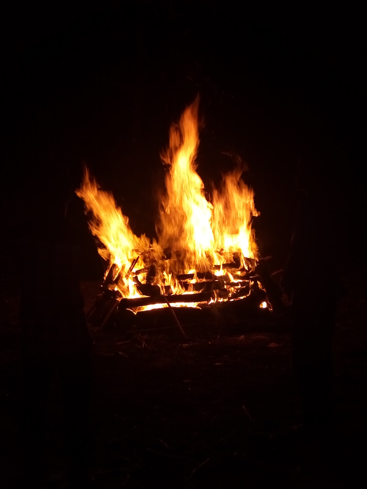

# Abstract

After tweeting this a couple of times, I decided to start my own ressource on the topic: 

> "Spatial Stuff in R for People indoctrinated with ArcGIS". 

I, like many, leared GIS in University using ArcGIS. It took me a considerable amount of time to learn that there are alternatives to ArcGIS, but not much longer to realize that I'm more attracted to these alternatives than to ArcGIS. When you transition from a proriatary Software like ArcGIS to FOSS, you have to relearn many of the concepts because the proprietery software usually does not adhere to common standards. 

There are already a great many spatial-R Ressources out there, and I'm not planning to rewrite everything that has been written. My aim is just to provide a resource for people looking to do spial stuff in R, but only know the ArcGIS-Term for it. This might mean that for some topics, I will simply provide a link to an existing ressource. 

Currently, I have to following topics in mind: 

- Making Maps
  - Dynamic, for exploration purposes
  - Static, for presentation purposes
- Select by Attribute
- Select by Location
- Topology Rules
- Spatial Joins
- Geoprocessing Tools
  - KDE
  - Multippoint to singlepoint
  - Merge, Join, Intersect, Erase...
  - Aggregate Polygons
  

