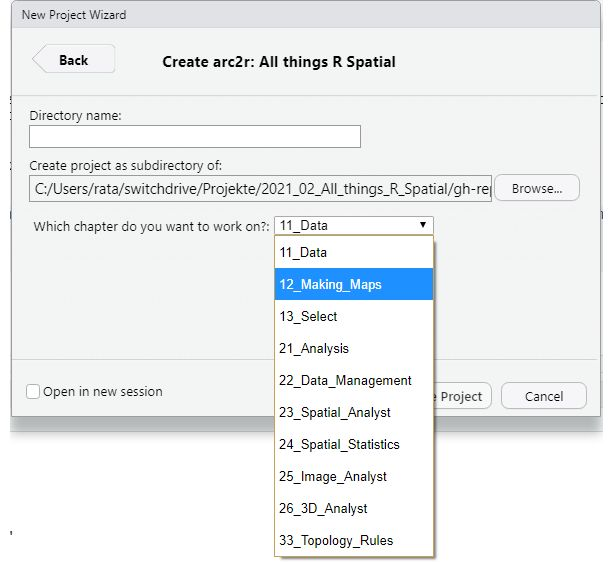

# How to use this book

The tutorials in this book are designed in a way for you to follow along easily. We will describe four different options:

- Work on your **local machine**
  a) With R Studio <- This is what we recommend for most users
  b) different IDE
- Work in **the Cloud** (via your browser)
  c) ZHAW's [RStudio-Cloud](https://rstudio-ide.zhaw.ch/) <- Only available for [ZHAW](https://www.zhaw.ch) Students and Teachers<sup>1</sup>
  d) RStudio's RStudio Cloud: [rstudio.cloud](https://rstudio.cloud/)


<sup>1</sup>: Login with your School Credentials. Contact [Nils](https://www.zhaw.ch/en/about-us/person/rata/) to apply for an account


Here is a quick overview of the steps necessary and the features available depending on which path you choose. We will explain these steps in more detail below:


```{r, echo = FALSE, purl= FALSE, message=FALSE}

library(readr)
library(dplyr)
library(flextable)
library(ftExtra)

steps <- read_csv("steps.csv")

# Replace this with a manual html table. The content of this table will not change, so using R for this is not necessary, inflexible and adds additional dependencies

steps %>%
  mutate(Step = paste(Step, Description, sep = " ")) %>%
  dplyr::select(-Description) %>%
  dplyr::rename(
    "a) RStudio" = local_rstudio,
    "b) different IDE" = local_other,
    "c) ZHAW Infrastructure" = cloud_zhaw,
    "d) RStudio Infrastructure" = cloud_rstudio
  ) %>%
  flextable() %>%
  merge_at(c(1),c(2,3)) %>%
  merge_at(c(1), c(4,5)) %>%
  merge_at(c(2), c(4,5)) %>%
  merge_at(3,c(2,3)) %>%
  flextable::theme_booktabs() %>%
  add_header_row(values = c("","Work on your local machine","Work on the Cloud (from your browser)"),colwidths = c(1,2,2)) %>%
  flextable::theme_zebra()  %>%
  flextable::align(1, part = "header",align = "center" ) %>%
  flextable::align(1, 2, align = "center") %>%
  flextable::align(1, 4, align = "center") %>%
  flextable::align(2, 4, align = "center") %>%
  flextable::align(3, 2, align = "center") %>%
  flextable::vline() %>%
  colformat_md()


```


## Step 1: Installing R {-}

To follow along, you will need a fairly new version of `R`, which you can download from [CRAN](https://cran.r-project.org/). See \@ref(sessioninfo) to find out the `R` and Package Version that we used. 


## Step 2: Installing RStudio {-}

To interact with `R`, using a good IDE is very helpful. We use RStudio ourselves (which you can download for free [here](https://rstudio.com/products/rstudio/download/)) but you are free to use your preferred software. 

## Step 3: Install the accompanying package `arc2r` {-}

This book has an accompanying package that will provide you with all the necessary datasets. Plus, installing this package in the right way (`dependencies = TRUE`) will also provide you with all the necessary packages, so you don't have to install them manually. 
Since the package is hosted on github and is not available on CRAN, you cannot install it the usual way (`install.packages("arc2r")`). Instead, you will have to install it using the `remotes` packages, which *is* on CRAN. This package will provide you with a function named `install_github()`, which allows installing packages from github. Note: Since the package contains all the datasets, this might take a while. You might get promted to upgrade your `R` packages: We recommend you do so. If you are afraid of messing up dependencies in other projects, cosider working with [`renv`](https://rstudio.github.io/renv/).

```{r, eval = FALSE}
install.packages("remotes")

remotes::install_github("arc2r/arc2r", dependencies = TRUE)
```

## Step 4: Create a new project {-}

If you are working with RStudio, you can make use of the RMarkdown Template that we provide you with the data package you installed in the last step. To use these, restart RStudio and create a new project (File > New Project). Choose "New Directory" and in the next window, click on the the template we created for following along (see figure \@ref(fig:projettemplate)).

Note that this feature is not available if you are using a different IDE than RStudio or if you are working on RStudio Cloud.


```{r projettemplate, out.width="49%", fig.show="hold", echo = FALSE, purl = FALSE, fig.cap = "To use the templates, click on 'Create project' and then on 'arc2r: all things R Spatial' "}
knitr::include_graphics(c("images/new_project.jpg", "images/template.jpg"))
```


```{r, out.width="49%", echo = FALSE, purl= FALSE, fig.cap="Now you can choose a chapter to work on"}


```


